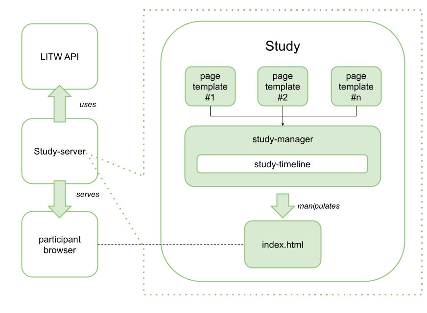

# Code Overview

With this quick overview you'll understand the main concepts and entities that compose a LITW study using this template.

0

In this diagram you can see the following entities:

  * **study-manager.js:** This is the core of a LITW study: the workflow manager. It is responsible for loading and manipulating the web-pages and JS functions that compose the interface with participants.
  * **page templates:** These are a set of HTML page structures (written in [Handlebars.js](https://handlebarsjs.com/) or whatever way you'd prefer) containing the content presented to the study participant.
  * **timeline:** The manager uses a timeline to organize the study pages in a sequence. In general, in each step a page is presented and some data is collected. Under the hood, we use the awesome [JsPsych framework](https://www.jspsych.org/7.3/overview/timeline/) --although an older version -- to manage that.
  * **index.html:** As usual, this is the main web page that the study participant is interacting with all the time. Its initial structure defines the needed resources (like CSS and JS) and some empty DIVs that will be manipulated by the Study Manager.
  * **API:** This is a *separate system* we created to simplify data management. You'll not have to bother about it: all you need to do is to call JS functions through our JS libraries.
  * **Study Server**: This is another *separate system* that, in its core, is simply a web-server that serves (dah!) all needed resources by the study. Our implementation has some special calls that helps you with data management.
  * **Browser:** This is the participant's web browser, fundamentally, the client part of any web-based system.

Is it clearer now?
(*If not, please [start a Q&A](https://github.com/labinthewild/LITW-study-templates/discussions/categories/q-a) thread!*)

## The timeline

Based on this architecture, one of the core code components you will want to examine is the `configureStudy()` function inside the `study-manager.js` file!
This function exists to simply configure the timeline of the study by adding *slides* to it.

Here is the basics:

``` javascript
var introTemplate = require("../templates/introduction.html");
//...
var timeline = [], 
params = {
    slides: {
        INTRODUCTION: {
            name: "introduction",
            type: "display-slide",
            template: introTemplate,
            display_element: $("#intro"),
            display_next_button: false,
        }
        //...
    }
}

function configureStudy() {
    timeline.push(params.slides.INTRODUCTION);
    // ...
}
```

As you can see, the timeline is nothing more than an Array and the `configureStudy` is a sequence of `push` calls to add slides to it.
Every slide though is a JS object that will configure the slide in a way our study engine understand how to present it.
Here is the basics of a LITW slide configuration:

  * a String for its `name`; (used, for instance, to track when the slide was accessed.)
  * a Type of the page: Most of the time, you will use the `display-slide` type which manages a lot of tracking and loading specifics for LTIW studies.
  * a Handlebar `template` (i.e., an HTML DIV specifying the page content); (the first like in the code shows how to load one.)
  * the `DIV ID` -- present in your `index.html` -- where you want to inject this page.
  * and finally the "optional" configuration `display_next_button` which can be used to hide the next button. This is generally useful if you want to trigger the next slide command in a special way.

An **important** thing to note is that you must have the DIVs for the slides added to your `index.html` page in order to use them in your timeline.

By definition, only one slide will be shown at a time. As soon as the NEXT button is "clicked" the LITW study engine will switch what is shown.

## Hands-on time!

How about implementing something new in the `study-base` to get a sense of how this should be done?
We've created the following HowTo tasks to warm you up:

  * [How to change a page's text?](3-ChangePageText.md)
  * [How to create a new study page?](4-AddNewPage.md)
  * [How to create a survey?](5-CreateSurvey.md)
  * [How to create dynamic pages?](6-LoadingComplexSlides-TheResultsPageCase.md)
