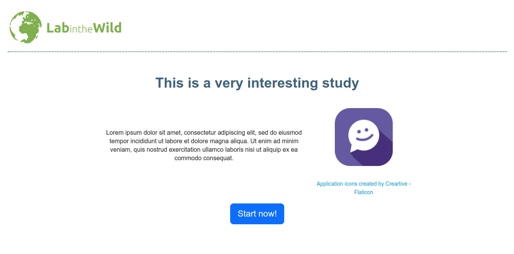

# How to... Change a page's text?

If you already here, it should be the case that you have [installed the base code for your study](1-Installation.md) and understands the [LITW study code structure](2-CodeExecutionOverview.md).

Now, changing the content in a slide should be as easy as changing the content in an HTML page. Let us do just that in code for `your-study` (of if you prefer, just use the `study-base`.)
The main lesson about implementing your own study is: **if you need to change anything from a resource offered in our template, copy the file first to your own study folder and chage that copy.** 
NEVER change files outside your study folder as they will not be deployed to our servers!!!

## Change the Introduction Page

In our base template, you have probably seen that the first page of the study is an **Introduction Page**. Should be something like this:



Now, you see that the title is kind of generic. 
What if we change it to something more specific, like `Learn about your XYZ with this LabintheWild Study!`

If you know enough of HTML you can imagine that this title is likely a `<h>` tag somewhere, right? Let us find where!

If you go to the `study-magager.js` file, you can find what HTML file we should look for. 
On the first lines of that file, you can see a sequence of lines that basically load all the used HTML templates like the one we want to change:

```javascript
var introTemplate = require("../templates/introduction.html");
```

Knowing that, we can go to the `introduction.html` file and change it! 
BUT BEFORE THAT, remember: if you are changing a file from outside of your study folder, you should first COPY it inside your study folder!
Something like:

```bash
mkdir my-study/pages
cp templates/introduction.html my-study/pages
```
(Obs.: I like to call this folder inside my study **pages** instead of **templates** but this is only a semantic preference.)

Now that you have your own copy of that page, you should change the reference inside the `study-manager` to point to the new file: `./pages/introduction.html` and open the file for edition!

At the top of this file, you will see something like this!

```html
 <div class="row">
     <div class="col d-flex justify-content-center">
         <h2 class="bolded-blue" data-i18n="litw-study-title"></h2>
     </div>
 </div>
```
Well! That may be a bit of a surprise that the **H2** tag does not directly have the text, but a reference to it in the `data-i18n` parameter. 
Why do we use this `data-i18n` instead of inserting text directly on the HTML page? That is because we are VERY pro internalization, and even if you do not intend to translate your study right now, we believe everything should be built to make that very easy!

We use the [Wikipedia's i18n library](https://github.com/wikimedia/jquery.i18n) to make translations almost transparent to you and the study participants.
All you need to do is to open the language file and change the entry related to the `litw-study-title` key use by the header HTML tag. 
In this case, your study English language file is `i18n/en.json`, and should look like this: 

```json
{
  "@metadata": {
    "authors": [
      "LITW Team"
    ],
    "locale": "en",
    "message-documentation": "qqq"
  },
  "litw-template-title": "This is your Project",
  "litw-template-loading": "Loading...",
  "litw-study-title": "This is a very interesting study",
  "...": "..."
}
```
All it is, is a `key:value` JSON file with all the strings you need to use in the HTML of your study.
As you can imagine, you just to need to change the title to whatever string you want and same it! 

## Check this worked!

To see the changes -- any changes from now on -- we recommend to:
1. stop the `devserver` if it is running (Ctrl+C on terminal)
2. build your study (as described [here](1-Installation.md#steps))
3. run the `devserver` and reload your study on the browser (as shown in the same installation instructions)

You should now see the new title of your study.

## What now?

Now that you know that every study page is just an HTML template that you can copy and change, you can make a bunch of improvements to your study. 

What if you need to add a completely new page? 
Check this [next tutorial page](4-AddNewPage.md)!

## What if this did not work?

1. Did you really refresh all components? Cash can always be an annoying thing while making small changes like this!
2. Try to open your browser console, deactivate cashing, and refresh the page. (Maybe opening the URL in a private window may help with cash as well.)
3. If you could not make this work:
   1. Search [our discussions](https://github.com/labinthewild/LITW-study-templates/discussions) for an answer.
   2. Open [an issue](https://github.com/labinthewild/LITW-study-templates/issues)!